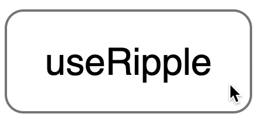

<div align="center">
  
  <br />
  <br />
  <a href="https://codesandbox.io/s/useripple-example-zt9ou" target="_blank">
    
  </a>
</div>

## About

`useRipple` is a [React Hook](https://reactjs.org/docs/hooks-intro.html) that adds an animated ripple effect to a clicked element.

## Usage

##### Step 1 - install the module

`npm install useripple`

##### Step 2 - add CSS keyframes

```css
@keyframes useRippleAnimation {
  to {
    transform: scale(15);
    opacity: 0;
  }
}
```

☝️This is the animation that ripples use to ripple. It makes them grow and then disappear. Tweak it however you want and add to your stylesheet.

##### Step 3 - add the Hook

```js
import React from 'react'
import useRipple from 'useripple'

function App() {
  const [
    addRipple, // Attach this to any mouse event listener
    ripples // Render this to see the ripples
  ] = useRipple({
    // You can pass ripples` CSS here (no worries, it's optional)
    background: 'pink'
  })

  // Look how simple it is!
  return (
    <div onClick={addRipple}>
      {ripples}
      Look at them ripplin'!
    </div>
  )
}
```

## FAQ

**Q:** Where should I attach `addRipple`?\
**A:** Any [MouseEvent](https://developer.mozilla.org/docs/Web/API/MouseEvent) listener will do, but your first bet is `onClick`, `onMouseDown` or `onMouseUp`.

**Q:** What if I want to do something more in my mouse event handler than just add ripples?\
**A:** That's simple! Instead of doing `<div onClick={addRipple}>` do `<div onClick={handleClick}>` and then declare `handleClick` function:

```js
function handleClick(event) {
  console.log("I'm gonna ripple!") // 👈 Do anything you want here
  addRipple(event) // Don't forget to feed `addRipple` with `event` 👌
}
```

**Q:** What is `ripples` variable?\
**A:** It's an array that gets filled with ripple components anytime you call `addRipple` function with a valid [MouseEvent](https://developer.mozilla.org/docs/Web/API/MouseEvent). Each ripple is an absolutely positioned `<div>`, so make sure their container has `position: relative;` or something other than default `static` (`overflow: hidden;` may come in handy too).

**Q:** What styles can I attach to ripples?\
**A:** Anything that's valid in React terms. See [here](https://github.com/robertkirsz/useripple/blob/master/src/index.js#L17-L28) what styles do ripples use. These are probably the ones you may want to override. If you want to override `animationName`, make sure you change it in Step 2 as well.

Enjoy! 💙

[](https://www.npmjs.com/package/useripple)  [](https://github.com/robertkirsz/useripple/blob/master/LICENSE)
